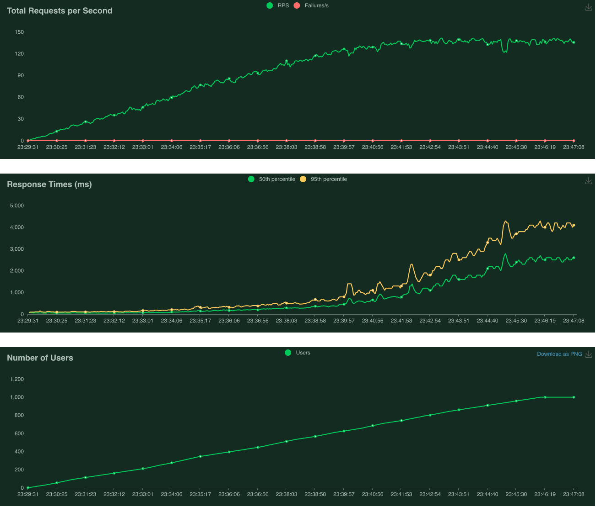

# kubernetes-microservices-demo (draft)
This page gives a guide for deploying a microservices demo project (<https://github.com/GoogleCloudPlatform/microservices-demo>) **Boutique Online** to AWS EKS. The original deployment target is Google Kubernetes Engine (GKE). This guide consists two parts,

1. Deploy the [project](https://github.com/GoogleCloudPlatform/microservices-demo) to AWS EKS
2. Use [Locust](https://locust.io/) tool to perform load test

# 1. Deploy the project to AWS EKS
## 1.1 Prerequisite
1. Install the AWS CLI: [Getting Started](https://docs.aws.amazon.com/cli/latest/userguide/cli-chap-getting-started.html)
2. Install kubernetes command line tool, kubectl: [Installation Guide](https://kubernetes.io/docs/tasks/tools/install-kubectl/)
3. Install AWS EKS CLI, eksctl: [Installation Guide](https://eksctl.io/introduction/#installation)
4. Clone the project from [GitHub](https://github.com/GoogleCloudPlatform/microservices-demo)

## 1.2 Create EKS cluster
Once all tools are properly installed and the respository is cloned, you can create the EKS cluster with the following command.

`eksctl create cluster --name <cluster name> --region <aws region> --version <kubenertes version> --nodes <number of nodes> --node-type <node machine type>`

Example

`eksctl create cluster --name boutique-online --region ap-southeast-1 --version 1.25 --nodes 3 --node-type t2.small`

Explanation of parameters
- `name`: cluster name
- `version`: support 1.22, 1.23, 1.24, 1.25
- `nodes`: default 2 nodes
- `node-type`: EC2 machine type, default is m5.large

It will take 10 - 15 minutes to complete the process. Last, you will see

`EKS cluster "<cluster name>" in "<aws region>" region is ready`


## 1.3 Verify VPC, Nodes
You can then verfiy the status of the cluster just created. `"ACTIVE"` should be responsed after running the following command.

*Note: All the following commands, example parameters will be used.*

Example

`aws eks describe-cluster --name boutique-online --query cluster.status`


Then review the status of the kubernetes system pods

`kubectl get pods -n kube-system`


You should notice **aws-node** and **kube-proxy** pods are in `RUNNING` state

## 1.4 Create Namespace
After verification, you can create a namespace called **boutique-online** for the deployment.

Example

`kubectl create namespace boutique-online`

## 1.5 Deploy to EKS
Ensure the repository is cloned, change to the `microservices-demo` directory, run the following command for deployment.

Example

`kubectl apply -f release/kubernetes-manifests.yaml -n boutique-online`

It will take 5 - 10 minutes to complete the deployment.

## 1.6 Review the deployment status and frontend external URL
When deployment is completed, you can review the status of pods and services using the following commands.

**Check the status of Pods**

If all pods are ready, the application is ready for test.

Example

`kubectl get pods -n boutique-online`


**Check the status of Services**

Example

`kubectl get services -n boutique-online`


**Retrieve the frontend external URL**

Example

`kubectl get svc frontend-external -n boutique-online`


The frontend-external URL is [ac8d5b2b5310745f2aee0d7ef40c1b88-1350472987.ap-southeast-1.elb.amazonaws.com](ac8d5b2b5310745f2aee0d7ef40c1b88-1350472987.ap-southeast-1.elb.amazonaws.com). You can access the URL via a web browser to test the website.

## 1.7 Clean up the deployment and related resources
Lastly, when all deployment and tests are finished, you can clean up the resources accordingly.

First delete the deployment, then delete the cluster. All related resources will be deleted.

Example

`kubectl delete -f kubernetes-manifests.yaml -n boutique-online`

`eksctl delete cluster --name boutique-online --region ap-southeast-1`

# 2. Use Locust tool to perform load test
This part is about using Locust tool to simulate user behaviours on the **Boutique Online** website with defined workload parameters and actions.

## 2.1 Simulation Parameters

The testing parameters is defined in the python script file [locustfile.py](scripts/locustfile.py).

### Simulation TaskSet
The following block of codes define six tasks simulating six user actions with weights assigned as illustrated below. Between each action, it will wait between 1 and 10 seconds.

```
class UserBehavior(TaskSet):

    def on_start(self):
        index(self)

    tasks = {index: 1,
        setCurrency: 2,
        browseProduct: 10,
        addToCart: 2,
        viewCart: 3,
        checkout: 1}

class WebsiteUser(HttpUser):
    tasks = [UserBehavior]
    wait_time = between(1, 10)
```

| Task | Action | Weight |
| --- |--- | :---: |
| index | Access the index page | 1 |
| setCurrency | Set the currency for the shop randomly | 2 |
| browseProduct | Browse a product randomly | 10 |
| addToCart | Add a product to the shopping cart with a random quantity | 2 |
| viewCart | View the shopping cart | 3 |
| checkout | Checkout the shopping cart | 1 |

### Number of users
The number of users and user spawn rate can be defined when you start the test either via web UI or command line.


The above example simulates 1000 users and spawning one user per second.

## 2.2 Test Results
As mentioned previously, the test starts from one user. Every second, one user is added. Each user performs the taskset discussed in previous section independently. Until 1000 users are running in parallel for around one minute, the test stops. The following tables and charts are captured from the Locust web UI and AWS dashboard.

### Tables of statistics
The **Request Statistics** table shows individual request and its general metrics.


The **Response Time Statistics** table focuses mainly on the response time categorised by percentile.


### Charts results
The following three charts show the results of **Total Request per Second**, **Response Time** and **Number of Users** versus time respectively.



### cluster and node metrics

### findings

## 2.3 Testing Machines
| Role | Machine | Specifications |
| --- | --- | --- |
| Boutique Application | AWS EKS Cluster | 3 nodes of t2.small machine, 1 vCPU, 2GB RAM |
| Test loader | MacBook Pro | Apple M1 CPU, 8GB RAM |