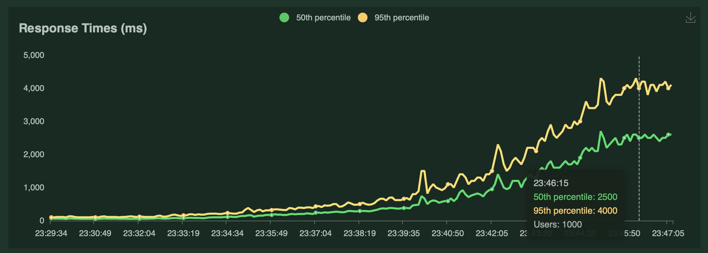
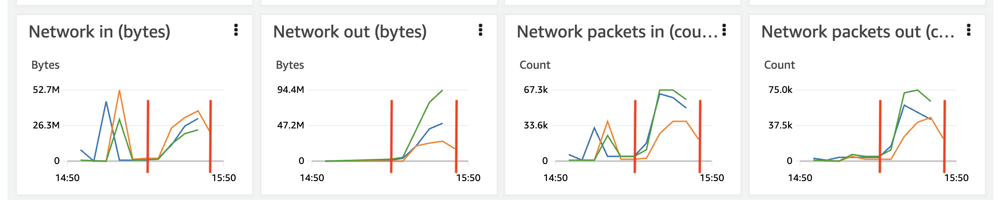

# Deploy and Test a Kubernetes Microservices Demo Project
This page is a guide describing the deployment and testing of the microservices demo project **Boutique Online** to AWS EKS, where the original deployment target is Google Kubernetes Engine (GKE).

Boutique Online project: <https://github.com/GoogleCloudPlatform/microservices-demo>

This guide consists two parts,
1. Deploy the [project](https://github.com/GoogleCloudPlatform/microservices-demo) to AWS EKS
2. Use [Locust](https://locust.io/) tool to perform load test

# 1. Deploy the project to AWS EKS
## 1.1 Prerequisite
1. Install the AWS CLI: [Getting Started](https://docs.aws.amazon.com/cli/latest/userguide/cli-chap-getting-started.html)
2. Install kubernetes command line tool, kubectl: [Installation Guide](https://kubernetes.io/docs/tasks/tools/install-kubectl/)
3. Install AWS EKS CLI, eksctl: [Installation Guide](https://eksctl.io/introduction/#installation)
4. Clone the project from [GitHub](https://github.com/GoogleCloudPlatform/microservices-demo)

## 1.2 Create EKS cluster
Once all tools are properly installed and the respository is cloned, you can create the EKS cluster with the following command.

`eksctl create cluster --name <cluster name> --region <aws region> --version <kubenertes version> --nodes <number of nodes> --node-type <node machine type>`

Example

`eksctl create cluster --name boutique-online --region ap-southeast-1 --version 1.25 --nodes 3 --node-type t2.small`

Explanation of parameters
- `name`: cluster name
- `version`: support 1.22, 1.23, 1.24, 1.25
- `nodes`: default 2 nodes
- `node-type`: EC2 machine type, default is m5.large

It will take 10 - 15 minutes to complete the process. Last, you will see

`EKS cluster "<cluster name>" in "<aws region>" region is ready`


## 1.3 Verify VPC, Nodes
You can then verfiy the status of the cluster just created using the following command. It should return `"ACTIVE"`.

*Note: For all the commands in this guide, example parameters will be used.*

`aws eks describe-cluster --name boutique-online --query cluster.status`


Then review the status of the kubernetes system pods

`kubectl get pods -n kube-system`


You should wait until **aws-node** and **kube-proxy** pods are in `Running` state

## 1.4 Create Namespace
After verification, you can create a namespace called **boutique-online** for the deployment.

`kubectl create namespace boutique-online`

## 1.5 Deploy to EKS
Ensure the repository is cloned, change to the `microservices-demo` directory, run the following command for deployment.

`kubectl apply -f release/kubernetes-manifests.yaml -n boutique-online`

It will take 5 - 10 minutes to complete the deployment.

## 1.6 Review the deployment status and frontend external URL
When deployment is completed, you can review the status of pods and services using the following commands.

**Check the status of Pods**

If all pods are ready, the application is ready for test.

`kubectl get pods -n boutique-online`


**Check the status of Services**

`kubectl get services -n boutique-online`


**Retrieve the frontend external URL**

`kubectl get svc frontend-external -n boutique-online`


The frontend-external URL is [ac8d5b2b5310745f2aee0d7ef40c1b88-1350472987.ap-southeast-1.elb.amazonaws.com](ac8d5b2b5310745f2aee0d7ef40c1b88-1350472987.ap-southeast-1.elb.amazonaws.com). You can access the URL via a web browser to test the website. *(Remark: The above URL is only for this example, please retrieve and test your own URL)*

## 1.7 Clean up the deployment and related resources
Lastly, when all deployment and tests are finished, you can clean up the resources accordingly.

First delete the deployment, then delete the cluster. All related resources will be deleted.

`kubectl delete -f kubernetes-manifests.yaml -n boutique-online`

`eksctl delete cluster --name boutique-online --region ap-southeast-1`

# 2. Use Locust tool to perform load test
This part is about using Locust tool to simulate user behaviours on the **Boutique Online** website with defined workload parameters and tasks.

## 2.1 Simulation Parameters

The testing parameters is defined in the python script file [locustfile.py](scripts/locustfile.py).

### Simulation TaskSet
The following block of codes define six tasks simulating six user actions with weights assigned as illustrated below. Between each action, it will wait between 1 and 10 seconds.

```
class UserBehavior(TaskSet):

    def on_start(self):
        index(self)

    tasks = {index: 1,
        setCurrency: 2,
        browseProduct: 10,
        addToCart: 2,
        viewCart: 3,
        checkout: 1}

class WebsiteUser(HttpUser):
    tasks = [UserBehavior]
    wait_time = between(1, 10)
```

**TaskSet**
| Task | Action | Weight |
| --- |--- | :---: |
| index | Access the index page | 1 |
| setCurrency | Set the currency for the shop randomly from 1 of the 4 currencies in the list | 2 |
| browseProduct | Browse a product randomly from 1 of the 9 products in the list | 10 |
| addToCart | Add a product to the shopping cart with a random quantity (1, 2, 3, 4, 5 or 10) | 2 |
| viewCart | View the shopping cart | 3 |
| checkout | Checkout the shopping cart by providing dummy information | 1 |

### Number of users
The number of users and user spawn rate can be defined when you start the test either via web UI or command line.


The above example simulates 1000 users and spawning one user per second. The host is the **frontend-external URL** retrieved in part 1.

## 2.2 Test Results
As mentioned previously, the test started from one user. In every second, one more user was added. Each user performed the taskset discussed in the previous section independently. Until 1000 users were running in parallel for around one minute, the test stopped. The following tables and charts were captured from the Locust web UI and AWS dashboard.

### Tables of statistics
The **Request Statistics** table shows individual request and its general metrics. There were totally 100727 requests made throughout the test without failture. However the response times varied between 37ms and 10099ms, which was a huge difference. Further study was required to have a more insightful comments. We will take **number of users** into consideration in the next section.


The **Response Time Statistics** table focuses mainly on the response time categorised by percentile.


### Charts results
The following three charts show the results of **Total Requests per Second**, **Response Times** and **Number of Users** versus time respectively.

It shows that when **Number of Users** was around 769, the **Total Requests per Second** reached to around 138 until the end of the test. This implies that the cluster cannot serve requests higher than 138 rps. Possible reasons will be discussed later.


The response time curves depicts a mild exponential rise of **Response Times** against **Number of Users** until the **Number of Users** reached the target 1000.



The response time curves become flucating when the **Number of Users** reached 619.


### Cluster Metrics
In addtion to the restuls from Locust, CPU and network statistics of the three cluster nodes were also captured from AWS monitoring dashboard for references.

*Notes: only consider the range between the red lines*

During the test, the **CPU Utilization** rose up with the increase of the **Number of Users**.

As each node hosts different pods of microservices, the CPU and network utilizations of different nodes were not with the same level but having similar trend.



### Discussions
As observed, the **Total Requests per Second** came to the peak value (around 138 rps) before the **Number of Users** was maximum at 1000. That means the cluster could not serve more than 138 rps.

Generally, there are four possible reasons for this limitation.

1. Low CPU power
2. Low disk I/O rate
3. Low Memory I/O rate
4. Low network bandwidth

From the statistics we got, #1 could be eliminated as the CPU utilization is at 44.7% maximum for the busiest node. #2 and #3 could not be the reasons neither, as the data volume is low and only kept in Redis memory cache.

The most sensible reason is #4 low network bandwidth. The cluster nodes are built from EC2 t2.small machine, its baseline network bandwidth is 128Mbps. From the network utilization charts shown above, it is noticed that the network I/O bandwidth of the green line could exceeds the bandwidth limit before 1000 users running together.

Another observation is when the **Number of Users** reached 619, the **Response Times** became fluctuating. This was not an indication of good performance especially for a client facing application. The **Response Times** also reached 460ms for 50th percentile of users. This can be further improved to enhance the user experience to meet the requirement of modern web applications.

[AWS EC2 Reference](https://docs.aws.amazon.com/AWSEC2/latest/UserGuide/general-purpose-instances.html#general-purpose-network-performance)

Another possible reason may come from the test loader machine running the Locust application. This test was conducted by a MacBook Pro, there were uncontrollable factors especially the instability of the network bandwidth under Wi-Fi connection.

### Further Enhancement
To further identify the limits of the cluster and the related environment, we could consider the following options to eliminate the network bandwidth constraint.
- Use more powerful cluster nodes, such as t2.2xlarge or above having higher network bandwidth
- Deploy the test loader into multiple machines on the cloud platform with (1) more stable network connection and (2) the traffic could be distributed rather than congesting on one machine

By eliminating the network bandwidth limitation, we could narrow down the scope of issues and finally optimise the solution and architecture design such that response time and user expericence can be improved.

## 2.3 Testing Environment
| Role | Machine | Specifications |
| --- | --- | --- |
| Boutique Web Application | AWS EKS Cluster | 3 nodes of t2.small machine, 1 vCPU, 2GB RAM |
| Test loader | MacBook Pro | Apple M1 CPU, 8GB RAM |